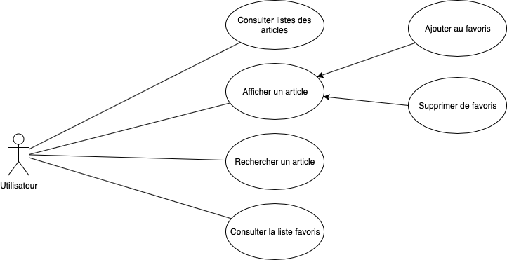

# CASIRAndroidProjet

    Application de < Consultation des articles > rassemble les titres d'actualités, journaux, 
    actualités quotidiennes, histoires populaires concernant tout intérêt ou passion. 

    Caractéristiques:
    1. Consulteez la liste des articles.
    2. Recherchez un article qui vous intéressent.
    3. Lisez les articles quotidiens complets.
    4. Marquez vos articles de presse quotidiens préférés pour les lire plus tard.
    5. Supprimez un article de votre liste favoris
    
    

    
    L'application constituée de 3 activités principales :
    - Activité n°1 : permet de récupérer une liste de articles sur un serveur et les afficher dans une liste.

    - Activité n°2 : permet de de consulter les détail d'un article choisi avec l'option d'ajouter ou supprimer de favoris.

    - Activité n°3 : permet de consulter la liste personnelle “favoris”. ainsi la possibilité de rechercher.

    
    
    - l'architecture suivant montre les differentes composants de l'application :

    
    
    L'application afficher deux listes "Liste des articles" et "liste favoris" :
    - liste "Liste des articles" est récupéré sur [le réseau](http://www.dailyinfospace.com/newsfeed.json) (volley et json).
    
    `    public List<Article> getData() {
        final List<Article> articles = new ArrayList<Article>();

        String URL = "http://www.dailyinfospace.com/newsfeed.json";
        // Instantiate the RequestQueue.
        RequestQueue queue = Volley.newRequestQueue(this.context);

        // get data using JsonObjectRequest
        JsonObjectRequest jsonObjectRequest = new JsonObjectRequest(
                Request.Method.GET,
                URL,
                null,
                new Response.Listener<JSONObject>() {
                    @Override
                    public void onResponse(JSONObject jsonObject) {

                        // Process the JSON
                        try {
                            // Get the JSON array
                            JSONArray array = jsonObject.getJSONArray("articles");

                            // Loop through the array elements
                            for (int i = 0; i < array.length(); i++) {
                                // Get current json object
                                JSONObject articleJson = array.getJSONObject(i);

                                Article article = new Article();

                                // Get the current article (json object) data
                                article.setId(0);
                                article.setAuthor(articleJson.getString("author"));
                                article.setTitle(articleJson.getString("title"));
                                article.setUrlToImage(articleJson.getString("urlToImage"));
                                article.setSourceName(articleJson.getJSONObject("source").getString("name"));
                                article.setPublishedAt(articleJson.getString("publishedAt"));
                                article.setDescription(articleJson.getString("description"));
                                article.setContent(articleJson.getString("content"));

                                articles.add(article);

                            }
                        } catch (JSONException e) {
                            e.printStackTrace();
                        }

                    }
                },
                new Response.ErrorListener() {
                    @Override
                    public void onErrorResponse(VolleyError volleyError) {
                        Log.e("jsonObject Error", volleyError.toString());
                    }
                }
        );

        // Add the request to the RequestQueue.
        queue.add(jsonObjectRequest);

        return articles;
    }`
    
    - liste "liste favoris" est récupéré sur stockage interne (shared preference), à l'aide de Gson qui permet de parser d'un objet Article au json :

    `public void OnClickSaveToFavorite(View view) {
        SharedPreferences sharedPreferences = getSharedPreferences("favorite_preferences", MODE_PRIVATE);
        SharedPreferences.Editor editor = sharedPreferences.edit();
        Gson gson = new Gson();
        // get old list and add current article
        List<Article> favoriteList = getsavedFavorite();
        favoriteList.add(article);
        // save to prefrences using json
        String json = gson.toJson(favoriteList);
        editor.putString("favorite_list", json);
        editor.apply();
        // show message to user
        Toast.makeText(this, "Saved to favorite list", Toast.LENGTH_LONG).show();
    }`

    Et de même pour recupérer la liste :
    
    `private List<Article> getSavedFavorite() {
        List<Article> savedFavoriteList = new ArrayList<Article>();
        SharedPreferences sharedPreferences = getSharedPreferences("favorite_preferences", MODE_PRIVATE);
        Gson gson = new Gson();
        String json = sharedPreferences.getString("favorite_list", null);
        Type type = new TypeToken<ArrayList<Article>>() {
        }.getType();
        savedFavoriteList = gson.fromJson(json, type);

        if (savedFavoriteList == null) {
            savedFavoriteList = new ArrayList<>();
        }

        return savedFavoriteList;
    }`

    L'application supporte  différentes tailles d'écran et ratation:
    - l'application a design homogène et propre sur l'ensemble des terminaux Android.
    - l'application gère des mode portrait et paysage.

